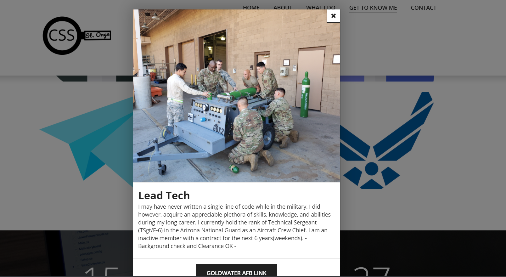

# Portfolio Update
A website to show off my skills as a full stack developer


## Overview
I was tasked with creating a Portfolio page that used some of the skills I've learned along the way. 


## Criteria
* Updated portfolio featuring Project 1 and two exemplary homework assignments.
* Updated GitHub profile with pinned repositories featuring Project 1 and two exemplary assignments.


## Design

I kept a simple design using a bootstrap css framework.  The page runs with jquery and javascript.


## Technologies Used

HTML, Bootstrap CSS, Logo Desgin, JavaScript, Jquery

[BootstrapCSS](https://https://www.free-css.com/free-css-templates)

[LogoDesign](https://https://www.freelogodesign.org)





## Links
[REPOSITORY](https://github.com/stongems/Portfolio-2.0/)
```
https://github.com/stongems/Portfolio-2.0/
```

[DEPLOYED](https://stongems.github.io/Portfolio-2.0/)
```
https://stongems.github.io/Portfolio-2.0/
```

[LINKEDIN](https://www.linkedin.com/in/matthew-st-onge-6a8038209)
```
https://www.linkedin.com/in/matthew-st-onge-6a8038209/
```
